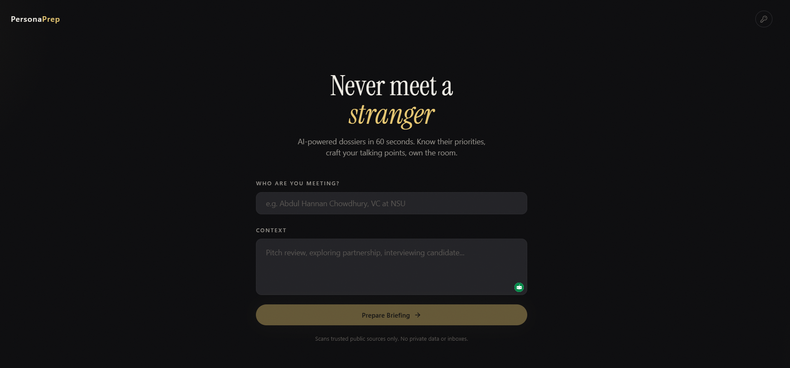

# PersonaPreparation

**Walk into any meeting knowing who you're meeting.**

You give it a name and a sentence about why you're meeting. It searches public sources, figures out who the person actually is, and hands back a one-page brief: their background, what they've been working on, what to talk about, and what to avoid.



---

## How It Works

The app first checks who the person likely is, asks you to confirm if the name is ambiguous, then researches that person and writes the brief.

1. Enter a person's name and meeting context.
2. PersonaPreparation runs a quick identity check.
3. If multiple people match, you pick the right one. If only one strong match, it skips ahead.
4. The agent searches public sources and streams its progress live.
5. You get a structured meeting brief.
6. Briefs are saved to your **History** so you can re-open or re-run them later.

Average end-to-end time: 30–90 seconds.

---

## What You Get

Each brief includes:

- Executive summary
- Professional background
- Recent activity and current focus
- Interests and preferences
- Meeting strategy
- Do's with reasoning
- Don'ts with reasoning
- Conversation openers
- Key talking points
- Potential concerns and how to address them
- Bottom-line recommendation
- Unknowns and evidence gaps
- Source URLs

You can copy the brief, download it as a PDF, or come back to it later from the **History** tab.

---

## Saved Briefs (History)

Every successful brief is saved locally to `backend/cache.db` (SQLite). The **History** button in the header lists them, most recent first.

For each saved brief you can:

- **Open** — view the original brief again.
- **Re-run** — prefill the form with the saved person + context, with "Force fresh research" checked, so you can pull a refreshed brief in one click.
- **Delete** — hard-delete the row. There's no soft delete or trash — once you delete, it's gone.

Re-runs append a new row; they don't overwrite the old one. So you keep a timeline of how someone's public profile evolves.

---

## Caching

PersonaPreparation caches search results and finished briefs in the same SQLite file:

- Tool results (Tavily, Brave, Firecrawl) are cached for 7–15 days.
- Finished briefs are cached for 15 days, keyed by name + context + identity + model + system prompt. Editing the prompt or upgrading the model invalidates every old brief automatically.
- A second request for the same person returns instantly with `from_cache: true`.
- Errors are never cached.
- To force a fresh run: tick the **Force fresh research** checkbox in the web UI, or pass `--force-refresh` (or `--no-cache`) on the CLI, or send `force_refresh: true` in the API request body.

---

## Quick Start

### Prerequisites

- Python 3.10+
- [`uv`](https://docs.astral.sh/uv/)
- Node.js 18+
- A shared backend/frontend auth token (you pick the value)
- An Anthropic API key, either:
  - configured on the backend, or
  - provided by the user in the frontend settings panel

### 1. Backend

```bash
cd backend
uv sync
uv run uvicorn main:app --reload
```

Create `backend/.env`:

```env
API_AUTH_TOKEN=your_shared_token
ANTHROPIC_API_KEY=your_key_here
TAVILY_API_KEY=your_key_here
FIRECRAWL_API_KEY=your_key_here
BRAVE_SEARCH_API_KEY=your_key_here
PERSONA_BRIEF_DIR=/abs/path/outside/repo
API_RATE_LIMIT=30
API_RATE_WINDOW_SECONDS=60
```

Notes:

- `API_AUTH_TOKEN` is required.
- `ANTHROPIC_API_KEY` is optional if users provide their own key in the frontend. The CLI still requires it.
- Tavily, Firecrawl, and Brave keys are optional, but research quality and coverage drop without them.
- `PERSONA_BRIEF_DIR` is the directory the CLI writes saved-brief markdown files to. Defaults to `~/PersonaPreparationBriefs`.
- `API_RATE_LIMIT` and `API_RATE_WINDOW_SECONDS` control per-IP rate limiting (defaults: 30 requests per 60 seconds).

Backend runs at `http://localhost:8000`.

### 2. Frontend

```bash
cd frontend
npm install
npm run dev
```

Create `frontend/.env.local`:

```env
NEXT_PUBLIC_API_URL=http://localhost:8000
NEXT_PUBLIC_API_ACCESS_TOKEN=your_shared_token
```

Frontend runs at `http://localhost:3000`.

---

## Configuration

### Required

- `API_AUTH_TOKEN` in `backend/.env`
- `NEXT_PUBLIC_API_ACCESS_TOKEN` in `frontend/.env.local`
- Both values must match exactly
- `NEXT_PUBLIC_API_URL` must point to the backend

### Anthropic API Key

You can use either:

1. `ANTHROPIC_API_KEY` on the backend (one shared key for everyone)
2. A user-provided API key entered in the frontend settings panel (stored in the user's browser only)

The frontend sends the user key in the request body when present; otherwise the backend falls back to its own.

### Optional Search and Scraping Keys

- `TAVILY_API_KEY`
- `FIRECRAWL_API_KEY`
- `BRAVE_SEARCH_API_KEY`

---

## Usage

### Web App

1. Open `http://localhost:3000`.
2. Enter the person's name.
3. Enter the meeting context.
4. (Optional) Tick **Force fresh research** to bypass any cached version.
5. Submit. If the name is ambiguous, pick the right person. If one strong match exists, the app skips this step.
6. Watch live progress while the agent searches and reads sources.
7. Review the final brief.
8. **Copy** to clipboard, **PDF** to download, or click **History** in the header to revisit it later.

Notes:

- In the current web UI, meeting context is required.
- The API allows `meeting_context` to be optional.

### CLI

```bash
cd backend
uv run cli.py
```

Flags:

- `--force-refresh` (alias `--no-cache`) — bypass the cache and re-run from scratch.

The CLI prompts for person + (optional) meeting context, runs the same agent loop, and offers to save the brief to `PERSONA_BRIEF_DIR` (or `~/PersonaPreparationBriefs`). It shares the same `cache.db` as the web server, so a brief generated in either place is reused by both.

---

## API

### Endpoints

- `GET /` — API info
- `GET /api/health` — health check
- `POST /api/research/disambiguate` — quick identity check, returns candidates
- `POST /api/research` — non-streaming research, returns the final brief
- `POST /api/research/stream` — same research, streamed as Server-Sent Events
- `POST /api/export/pdf` — markdown brief → base64 PDF
- `GET /api/history?limit=50&offset=0` — paginated list of saved briefs
- `GET /api/history/{id}` — full saved brief
- `DELETE /api/history/{id}` — hard-delete a saved brief (404 if missing)

All endpoints require `X-API-Key: <API_AUTH_TOKEN>`.

### Typical Flow

1. Call `/api/research/disambiguate` to check the name.
2. If the name is ambiguous, let the user choose a candidate.
3. Call `/api/research/stream` with either:
   - `selected_identity`, or
   - `continue_anyway=true`

Swagger docs are available at `http://localhost:8000/docs`.

### Request Notes

- All `POST` endpoints accept `person_name`.
- `meeting_context` is optional at the API level.
- `anthropic_api_key` is optional; when present, it overrides the backend default key.
- `force_refresh: true` bypasses both the per-tool cache and the brief cache.
- `POST /api/export/pdf` accepts `{ "brief": "<markdown>", "person_name": "<name>" }` and returns `{ filename, content_type, pdf_base64 }`. The frontend decodes the base64 into a local PDF download.

---

## Development

### Backend

```bash
cd backend
uv sync
uv run uvicorn main:app --reload --host 0.0.0.0 --port 8000
```

### Script Tests

Run from `backend/`:

```bash
uv run python scripts/test_config.py
uv run python scripts/test_utils.py
uv run python scripts/test_tools.py
uv run python scripts/test_agent.py
uv run python scripts/test_cli.py
uv run python scripts/test_prompt_contract.py
uv run python scripts/test_models.py
uv run python scripts/test_disambiguation.py
uv run python scripts/test_readme_contract.py
uv run python scripts/test_pdf_export.py
uv run python scripts/test_cache.py
uv run python scripts/test_history.py
uv run python scripts/test_frontend_research_flow.py
```

### Frontend

```bash
cd frontend
npm run build
```

`npm run build` runs the type-checker and bundler — treat a clean build as the frontend regression check.

---

## Limitations

- Research depends on public web data quality.
- External APIs may be slow, incomplete, or rate-limited.
- Identity disambiguation is heuristic, not guaranteed.
- Some pages may not scrape cleanly.
- Each research session is stateless from the agent's perspective; only the final brief is saved to history.

---

## Privacy

PersonaPreparation works only from public web sources.

It does not:

- access private accounts or inboxes
- claim certainty when identity or evidence is weak
- share your data with anyone — everything stays on your machine

Saved briefs and the search/brief cache live in a local SQLite file (`backend/cache.db`). Deleting a row from **History** hard-deletes it. The DB is in `.gitignore` so it never leaves your machine.

You should still verify important claims before acting on them.

---

## Project Structure

```text
PersonaPreparation/
|-- backend/
|   |-- main.py        # FastAPI server + endpoints
|   |-- agent.py       # Agent loop + identity disambiguation
|   |-- tools.py       # Tavily / Brave / Firecrawl wrappers
|   |-- models.py      # Pydantic request/response models
|   |-- config.py      # Constants, system prompt, tool schemas
|   |-- utils.py       # Validation, filename sanitisation, brief saving
|   |-- cli.py         # Terminal entry point
|   |-- cache.py       # SQLite cache (tool results + briefs, TTL'd)
|   |-- history.py     # SQLite saved-brief history (user-visible)
|   `-- scripts/       # Script-based test runners
|-- frontend/
|   |-- src/app/           # 5-state SPA (input/disambiguation/researching/result/history)
|   |-- src/components/ui/ # Buttons, inputs, etc.
|   `-- src/lib/           # API client
|-- docs/
|   |-- tech_spec.md   # Architecture + design decisions
|   `-- progress.md    # Session-by-session change log
|-- demo/              # Screenshots used in this README
`-- README.md
```

---

## License

This project is licensed under the [MIT License](LICENSE).

## Author

Rahat Kabir — [Website](https://rahatkabir.me) · [GitHub](https://github.com/Rahat-Kabir) · [Email](mailto:rahatkabir0101@gmail.com)
