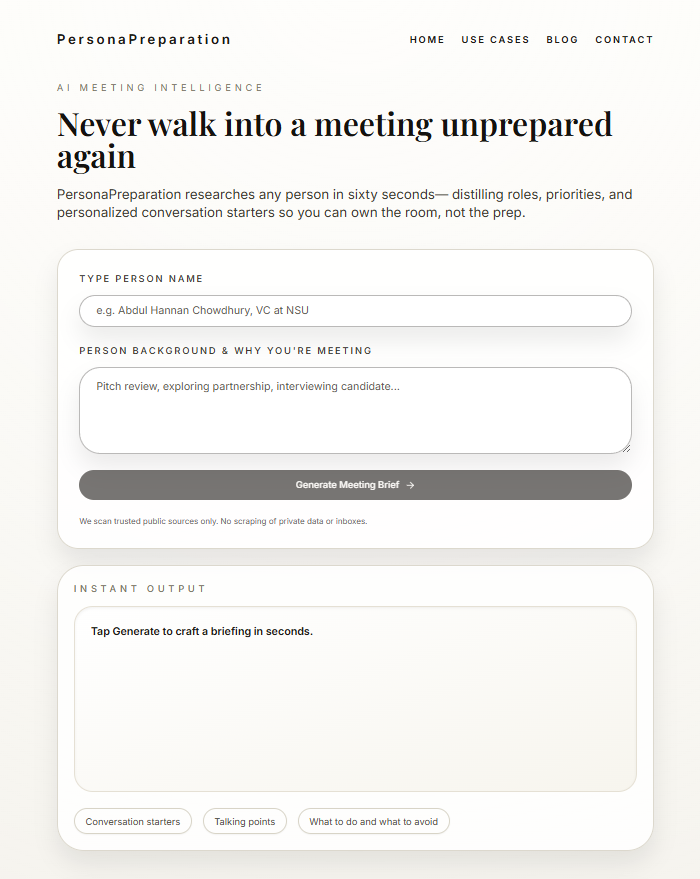

# PersonaPreparation

**AI meeting strategist that researches people and tells you exactly what to do—and what to avoid.**

Get strategic meeting briefs with conversation openers based on their recent work, DO's and DON'Ts with reasoning, and bottom-line recommendations tailored to your meeting context. Powered by autonomous Claude agent with real-time web research.

## Demo


_Real-time research progress with live tool execution tracking_

## Features

- 🔍 **Real-time Research**: Live web search using Tavily, Brave Search, and Firecrawl APIs
- 🤖 **Autonomous Agent**: Claude decides which tools to use and when (up to 15 iterations)
- 📊 **Structured Briefs**: Professional summaries with insights, conversation starters, and background
- 🌐 **Web Interface**: Modern Next.js frontend with **live SSE streaming** progress updates
- ⚡ **Real-time Feedback**: See exactly what the agent is doing as it researches (tool calls, results, iterations)
- 🚀 **FastAPI Backend**: High-performance async API with streaming support
- 🎯 **Context-Aware**: Tailors research to your meeting context

## Project Structure

```
PersonaPreparation/
├── backend/                          # Python backend
│   ├── main.py                       # FastAPI server
│   ├── models.py                     # Pydantic models
│   ├── persona_agent_tools.py        # Core agent with web tools
│   ├── pyproject.toml                # Python dependencies
│   ├── uv.lock                       # Locked dependencies
│   └── .env                          # Backend environment variables (not in repo)
├── frontend/                         # Next.js frontend
│   ├── src/
│   │   ├── app/                      # App router pages
│   │   │   ├── page.tsx              # Main research page
│   │   │   ├── layout.tsx            # Root layout
│   │   │   └── globals.css           # Global styles
│   │   ├── components/               # React components
│   │   │   └── ui/                   # UI components (button, input, etc.)
│   │   └── lib/                      # API client & utilities
│   │       ├── api.ts                # API client with SSE support
│   │       └── utils.ts              # Utility functions
│   ├── package.json                  # Node dependencies
│   └── .env.local                    # Frontend environment variables (not in repo)
└── README.md                         # This file
```

## Quick Start

### Prerequisites

- **Python 3.10+** with [uv](https://docs.astral.sh/uv/) package manager
- **Node.js 18+** with npm
- **Anthropic API key** from [console.anthropic.com](https://console.anthropic.com/)

### Optional API Keys (for real-time research)

- **Tavily API**: [tavily.com](https://tavily.com/) - AI-powered search
- **Firecrawl API**: [firecrawl.dev](https://firecrawl.dev/) - Web scraping
- **Brave Search API**: [brave.com/search/api](https://brave.com/search/api/) - News search

## Installation & Setup

### Required security configuration

Before starting either server, create a shared authentication token and configure the environment:

1. Add `API_AUTH_TOKEN=<strong shared token>` to `backend/.env`. This is required for the FastAPI endpoints to start.
2. In `frontend/.env.local`, set both `NEXT_PUBLIC_API_URL` (pointing to your backend, e.g., `http://localhost:8000`) and `NEXT_PUBLIC_API_ACCESS_TOKEN` to the same token value from step 1.
3. Redeploy/restart both services so the new configuration takes effect.

### 1. Backend Setup

```bash
# Navigate to backend folder
cd backend

# Create .env file manually with the following content:
# ANTHROPIC_API_KEY=your_key_here          (Required)
# API_AUTH_TOKEN=choose_a_strong_token     (Required - must match frontend)
# TAVILY_API_KEY=your_key_here             (Optional - for web search)
# FIRECRAWL_API_KEY=your_key_here          (Optional - for scraping)
# BRAVE_SEARCH_API_KEY=your_key_here       (Optional - for news search)
# PERSONA_BRIEF_DIR=/abs/path/outside/repo (Optional - override brief output directory)

# Install Python dependencies
uv sync

# Run the FastAPI server
uv run uvicorn main:app --reload
```

Backend will be available at: `http://localhost:8000`

### 2. Frontend Setup

```bash
# Navigate to frontend folder
cd frontend

# Create .env.local file with your backend URL
# On Windows PowerShell:
# New-Item -Path .env.local -ItemType File -Value "NEXT_PUBLIC_API_URL=http://localhost:8000"
# On Linux/Mac:
# cat <<'EOF' > .env.local
# NEXT_PUBLIC_API_URL=http://localhost:8000
# NEXT_PUBLIC_API_ACCESS_TOKEN=choose_a_strong_token    # Must match API_AUTH_TOKEN
# EOF

# Install Node dependencies
npm install

# Run the development server
npm run dev
```

Frontend will be available at: `http://localhost:3000`

## Usage

### Web Interface

1. Open `http://localhost:3000` in your browser
2. Enter the person's name (required)
3. Add meeting context (required) - e.g., "job interview", "sales call", "pitch review"
4. Click "Generate Meeting Brief"
5. **Watch real-time progress** as the agent searches and scrapes (30-60 seconds)
   - See tool calls: "Searching with Tavily...", "Scraping webpage..."
   - View results: "✓ Found 5 results"
   - Track iterations and research steps
6. View the structured brief with insights and conversation starters
7. Copy or save the brief for your meeting

> **Note**: The web interface currently requires meeting context for better results. Use the CLI version if you want context to be truly optional.

### CLI Version (Legacy)

You can still use the original command-line interface:

```bash
cd backend
uv run persona_agent_tools.py
```

The CLI version allows optional meeting context and saves briefs to the directory specified by `PERSONA_BRIEF_DIR` (defaults to `~/PersonaPreparationBriefs`) as markdown files.

## How It Works

### Backend (FastAPI + Anthropic SDK)

1. **API Endpoint**: Receives research requests via REST API
2. **Agent Execution**: Runs autonomous research loop with tool calling
3. **Tool Integration**:
   - `tavily_search()` - AI-powered web search
   - `brave_search()` - News and recent content search
   - `firecrawl_scrape()` - Extract content from URLs (LinkedIn, articles, etc.)
4. **Response**: Returns structured meeting brief in markdown format

### Frontend (Next.js + React)

1. **Research Form**: Collects person name and meeting context
2. **API Client**: Connects to FastAPI backend via SSE streaming
3. **Real-time Progress**: Shows live updates as agent works
   - Current tool being used (Tavily, Brave, Firecrawl)
   - Search queries and URLs being processed
   - Result summaries and iteration count
4. **Brief Display**: Renders markdown brief with formatting
5. **Export Options**: Copy to clipboard functionality

### Agent Research Flow

The agent autonomously decides:

1. **Broad search** for professional background (Tavily)
2. **Recent news** with freshness filters (Brave)
3. **Deep dives** into specific URLs (Firecrawl)
4. **Achievements** research (publications, awards)
5. **Synthesis** into structured brief

## API Documentation

### Backend Endpoints

**Health Check**

```
GET /api/health
Response: { "status": "healthy", "timestamp": "..." }
```

**Research Person (Standard)**

```
POST /api/research
Request: {
  "person_name": "string (required)",
  "meeting_context": "string (optional)"
}

Response: {
  "success": boolean,
  "brief": "markdown string",
  "person_name": "string",
  "timestamp": "ISO-8601",
  "error_message": "string (if failed)"
}
```

**Research Person (Streaming SSE)**

```
POST /api/research/stream
Request: {
  "person_name": "string (required)",
  "meeting_context": "string (optional)"
}

Response: Server-Sent Events stream
Event types:
  - start: Research begins
  - thinking: Agent processing
  - tool_call: Tool being executed (tavily_search, brave_search, firecrawl_scrape)
  - tool_result: Tool execution result with summary
  - complete: Final brief ready
  - error: Error occurred

Event format:
event: <type>
data: {"event_type": "...", "data": {...}, "timestamp": "...", "iteration": N}
```

## Development

### Backend Development

```bash
cd backend

# Install dependencies
uv sync

# Run with auto-reload
uv run uvicorn main:app --reload --host 0.0.0.0 --port 8000

# View API docs (when server is running)
# Open http://localhost:8000/docs
```

### Frontend Development

```bash
cd frontend

# Install dependencies
npm install

# Run development server
npm run dev

# Build for production
npm run build

# Run production build
npm start
```

## Architecture

### Tech Stack

**Backend:**

- FastAPI - Modern async Python web framework
- Anthropic SDK - Claude AI integration
- Pydantic - Data validation
- Uvicorn - ASGI server
- Research APIs: Tavily, Brave Search, Firecrawl

**Frontend:**

- Next.js 14+ (App Router)
- React with TypeScript
- Tailwind CSS for styling
- Fetch API for backend communication

### Key Files

**Backend:**

- [backend/main.py](backend/main.py) - FastAPI application with SSE streaming
- [backend/models.py](backend/models.py) - Pydantic models for requests/responses
- [backend/persona_agent_tools.py](backend/persona_agent_tools.py) - Core agent logic with tool execution

**Frontend:**

- [frontend/src/app/page.tsx](frontend/src/app/page.tsx) - Main research page with live updates
- [frontend/src/lib/api.ts](frontend/src/lib/api.ts) - API client with SSE support
- [frontend/src/app/layout.tsx](frontend/src/app/layout.tsx) - Root layout

**Documentation:**

## Environment Variables

### Backend (backend/.env)

```bash
ANTHROPIC_API_KEY=sk-...              # Required
API_AUTH_TOKEN=your_shared_token     # Required for FastAPI endpoints
TAVILY_API_KEY=tvly-...               # Optional (for web search)
FIRECRAWL_API_KEY=fc-...              # Optional (for scraping)
BRAVE_SEARCH_API_KEY=...              # Optional (for news)
PERSONA_BRIEF_DIR=/abs/path...        # Optional, overrides default brief export path
```

### Frontend (frontend/.env.local)

```bash
NEXT_PUBLIC_API_URL=http://localhost:8000
NEXT_PUBLIC_API_ACCESS_TOKEN=your_shared_token   # Must match API_AUTH_TOKEN
```

## Deployment

### Backend Deployment

1. Set environment variables on your hosting platform
2. Install dependencies: `uv sync`
3. Run: `uv run uvicorn main:app --host 0.0.0.0 --port $PORT`

### Frontend Deployment

1. Update `NEXT_PUBLIC_API_URL` to your backend URL
2. Build: `npm run build`
3. Deploy to Vercel, Netlify, or any static hosting

## Limitations

- **Stateless**: Each research session is independent, no conversation memory
- **API Dependencies**: Requires external API keys for full functionality
- **Rate Limits**: External APIs have usage quotas
- **LinkedIn Scraping**: May be blocked; depends on Firecrawl's capabilities
- **Research Time**: Typically 30-60 seconds per person

## Privacy & Ethics

PersonaPreparation only accesses **publicly available information**. It does not:

- Access private databases or paid content
- Store personal data beyond the current session
- Share information with third parties
- Use information for purposes beyond meeting preparation

Users should:

- Respect privacy and use responsibly
- Verify information from multiple sources
- Not use for surveillance or harmful purposes

## Roadmap

- ✅ **MVP**: CLI agent with real-time web research
- ✅ **Web UI**: Next.js frontend with FastAPI backend
- ✅ **Real-time Streaming**: Live progress updates via Server-Sent Events (SSE)
- 📋 **Export Options**: PDF export, email integration
- 📋 **History**: Brief history and search

## Troubleshooting

### Backend not starting

- Check if port 8000 is available
- Verify `ANTHROPIC_API_KEY` is set in `backend/.env`
- Run `uv sync` to ensure dependencies are installed

### Frontend not connecting

- Verify backend is running at `http://localhost:8000`
- Check `NEXT_PUBLIC_API_URL` in `frontend/.env.local`
- Clear browser cache and reload

### Next dev fails with module errors

- Try deleting `node_modules` and `package-lock.json`, then run `npm install` again
- Ensure you're running the commands in the correct directory (`frontend/`)
- On Windows, make sure you're using PowerShell or Command Prompt, not WSL

### Research failing

- Verify API keys in `backend/.env`
- Check API rate limits and quotas
- Review backend logs for errors

## 🤝 Contributing

Contributions, issues, and feature requests are welcome!

1. Fork the repository
2. Create your feature branch (`git checkout -b feature/amazing-feature`)
3. Commit your changes (`git commit -m 'feat: add amazing feature'`)
4. Push to the branch (`git push origin feature/amazing-feature`)
5. Open a Pull Request

Please follow [Conventional Commits](https://www.conventionalcommits.org/) for commit messages.

## 👤 Author

**Rahat Kabir**

- GitHub: [@Rahat-Kabir](https://github.com/Rahat-Kabir)
- Repository: [PersonaPreparation](https://github.com/Rahat-Kabir/PersonaPreperation)

## ⭐ Show Your Support

Give a ⭐️ if this project helped you prepare for better meetings!

## 📝 License

This project is [MIT](LICENSE) licensed.

rahatkabir0101@gmail.com

Copyright © 2025 Rahat Kabir

## 🙏 Acknowledgments

- [Anthropic](https://www.anthropic.com/) for Claude AI
- [Tavily](https://tavily.com/) for AI-powered search API
- [Firecrawl](https://firecrawl.dev/) for web scraping capabilities
- [Brave](https://brave.com/search/api/) for search API

## 💬 Support

For issues and questions:

- 🐛 [Report bugs](https://github.com/Rahat-Kabir/PersonaPreperation/issues)
- 💡 [Request features](https://github.com/Rahat-Kabir/PersonaPreperation/issues)
- 📖 [Anthropic SDK Docs](https://github.com/anthropics/anthropic-sdk-python)
- 📚 [Claude Documentation](https://docs.anthropic.com/)

---

**Built with Claude AI** • Empowering confident, prepared meetings
